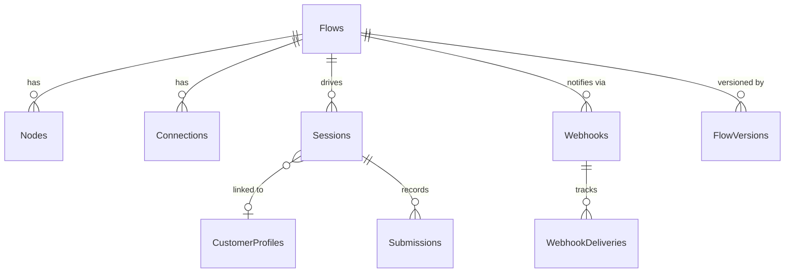

# Waymark

Waymark is a schema-driven journey orchestration engine for onboarding and compliance workflows:
- A .NET 10 backend API for flow definition, session orchestration, compliance checks, document upload, Server-Sent Event progress, and webhooks
- A React + Vite frontend for rendering dynamic onboarding steps and visualizing flow paths
- CI/CD workflows for validation and cloud deployment targets (Azure and AWS)

## Documentation map

- [`getting-started.md`](./getting-started.md) — prerequisites, local setup, and contribution workflow
- [`user-guide.md`](./user-guide.md) — persona model, session lifecycle, and webhook integration
- [`docs/journey-json.md`](./docs/journey-json.md) — journey JSON notation, structure, frontend linkage, and visualization
- [`feature-gaps.md`](./feature-gaps.md) — known gaps tracked as GitHub issues

## Repository structure

```text
Waymark/
├── Dockerfile
├── docker-compose.yml
├── src/
│   ├── backend/
│   │   ├── OpenOnboarding.Api/            # ASP.NET Core controllers, authN/authZ, OpenAPI
│   │   ├── OpenOnboarding.Application/    # Ports (interfaces), contracts, validators
│   │   ├── OpenOnboarding.Domain/         # Entities and enums
│   │   ├── OpenOnboarding.Infrastructure/ # EF Core, workflow engine, compliance, webhooks
│   │   ├── OpenOnboarding.Application.Tests/  # xUnit unit and integration tests
│   │   ├── OpenOnboarding.Pact.Tests/     # PactNet provider verification tests
│   │   └── OpenOnboarding.slnx
│   └── frontend/
│       ├── src/
│       │   ├── builder/       # JourneyBuilder — React Flow graph visualization
│       │   ├── onboarding/    # StepRenderer, hooks, API client, types
│       │   ├── pact/          # Pact consumer tests
│       │   └── schemas/       # Example flow definition JSON
│       ├── package.json
│       └── vite.config.ts
└── .github/workflows/
    ├── ci.yml
    ├── cd-azure.yml
    └── cd-aws.yml
```

## Architecture

The backend follows a Ports & Adapters (Hexagonal) structure. Dependency direction flows inward: adapters depend on ports; the domain and application layers have no knowledge of infrastructure implementations.

| Layer | Project | Responsibility |
|---|---|---|
| Domain | `OpenOnboarding.Domain` | `Flow`, `Node`, `Connection`, `Session`, `Submission`, `CustomerProfile`, `Webhook` entities; `NodeType`, `ConditionOperator`, `SessionStatus` enums |
| Application | `OpenOnboarding.Application` | Service interfaces (ports), request/response contracts, FluentValidation validators |
| Infrastructure | `OpenOnboarding.Infrastructure` | `WorkflowService`, `ComplianceRuleEvaluator`, `FlowService`, `WebhookService`, EF Core `OnboardingDbContext`, logic node executors |
| API | `OpenOnboarding.Api` | ASP.NET Core controllers, JWT + API key authentication, RBAC policies, OpenAPI |

The frontend is a Vite React application:
- `StepRenderer` — reads `NodeDto.JsonContent` and renders type-appropriate UI (`Form`, `DocumentUpload`, `Redirect`, `Information`, `Logic`)
- `JourneyBuilder` — React Flow graph for visual flow editing and branch-path inspection
- `useOnboarding` hook — manages session state and consumes Server-Sent Events

---

## Database design

Waymark uses PostgreSQL (via EF Core) with the following schema. Migrations live in `src/backend/OpenOnboarding.Infrastructure/Migrations/` and are applied automatically on startup.

### Entity–relationship overview



### Table reference

#### `Flows`

Versioned container for nodes and connections.

| Column | Type | Constraints | Description |
|--------|------|-------------|-------------|
| `Id` | `uuid` | PK | Flow identifier |
| `Name` | `varchar(200)` | NOT NULL | Display name |
| `Description` | `varchar(2000)` | nullable | Optional description |
| `Version` | `integer` | NOT NULL | Current working version number |
| `CreatedAt` | `timestamptz` | NOT NULL | Row creation timestamp |
| `UpdatedAt` | `timestamptz` | NOT NULL | Last modification timestamp |

#### `Nodes`

A single step in a flow. `JsonContent` carries type-specific configuration; `ComplianceRuleJson` carries validation rules applied at submission time.

| Column | Type | Constraints | Description |
|--------|------|-------------|-------------|
| `Id` | `uuid` | PK | Node identifier |
| `FlowId` | `uuid` | FK → `Flows.Id` CASCADE | Owning flow |
| `Key` | `varchar(100)` | NOT NULL, UNIQUE per flow | Stable string identifier (used in routing logic and URL interpolation) |
| `Type` | `integer` | NOT NULL | Enum: `Form=0`, `Information=1`, `Logic=2`, `Redirect=3`, `DocumentUpload=4` |
| `Title` | `varchar(200)` | NOT NULL | Display title shown to the end user |
| `JsonContent` | `text` | NOT NULL | Type-specific configuration JSON (field definitions, upload constraints, redirect URL, etc.) |
| `ComplianceRuleJson` | `text` | nullable | Server-side validation rules (see [ComplianceRuleJson reference](#compliancerulejson-reference)) |
| `IsStartNode` | `boolean` | NOT NULL | Exactly one node per flow must be `true`; validated on flow creation |
| `ExecutionErrorJson` | `text` | nullable | Populated when a Logic node with `failOnError: true` throws; contains error detail |
| `CreatedAt` | `timestamptz` | NOT NULL | Row creation timestamp |
| `UpdatedAt` | `timestamptz` | NOT NULL | Last modification timestamp |

**Indexes:** `(FlowId, Key)` UNIQUE · `(FlowId, IsStartNode)`

#### `Connections`

Directed edges between nodes. An absent `ConditionField` means the connection is unconditional (fallback).

| Column | Type | Constraints | Description |
|--------|------|-------------|-------------|
| `Id` | `uuid` | PK | Connection identifier |
| `FlowId` | `uuid` | FK → `Flows.Id` CASCADE | Owning flow |
| `SourceNodeId` | `uuid` | NOT NULL | Outgoing node |
| `TargetNodeId` | `uuid` | NOT NULL | Incoming node |
| `ConditionField` | `text` | nullable | Payload field name to evaluate; if null the connection always matches |
| `ConditionOperator` | `integer` | nullable | Enum: `Equals=0`, `NotEquals=1`, `Exists=2`, `Contains=3`, `NotContains=4`, `StartsWith=5`, `EndsWith=6`, `GreaterThan=7`, `LessThan=8`, `GreaterThanOrEqual=9`, `LessThanOrEqual=10`, `MatchesRegex=11` |
| `ConditionValue` | `text` | nullable | Right-hand side of the condition |
| `Priority` | `integer` | NOT NULL | Lower values evaluated first; fallback connections (no `ConditionField`) sorted last within the same priority |

**Indexes:** `FlowId`

#### `CustomerProfiles`

Optional customer record, upserted by `ExternalCustomerId` when supplied with a session start request. Condition evaluation falls back to `Country` and `Email` from the profile when those fields are absent from the submitted payload.

| Column | Type | Constraints | Description |
|--------|------|-------------|-------------|
| `Id` | `uuid` | PK | Internal identifier |
| `ExternalCustomerId` | `varchar(200)` | NOT NULL, UNIQUE | Caller-supplied identifier (e.g., CRM ID) |
| `Country` | `varchar(10)` | NOT NULL | ISO country code or short string |
| `Email` | `varchar(320)` | NOT NULL | Customer email |
| `MetadataJson` | `text` | NOT NULL | Arbitrary key-value map written by `SetProfileField` Logic node actions |
| `CreatedAt` | `timestamptz` | NOT NULL | Row creation timestamp |
| `UpdatedAt` | `timestamptz` | NOT NULL | Last modification timestamp |

**Indexes:** `ExternalCustomerId` UNIQUE

#### `Sessions`

Runtime instance of a flow for a customer. `CurrentNodeId` advances with each step; `null` indicates a completed or abandoned session.

| Column | Type | Constraints | Description |
|--------|------|-------------|-------------|
| `Id` | `uuid` | PK | Session identifier |
| `FlowId` | `uuid` | FK → `Flows.Id` RESTRICT | The flow being executed (restricted to prevent accidental flow deletion) |
| `CurrentNodeId` | `uuid` | nullable | ID of the node awaiting submission; `null` when completed |
| `CustomerProfileId` | `uuid` | nullable, FK → `CustomerProfiles.Id` SET NULL | Associated customer profile; SET NULL on profile deletion |
| `Status` | `integer` | NOT NULL | Enum: `Started=0`, `Completed=1`, `Abandoned=2`, `Error=3` |
| `CreatedAt` | `timestamptz` | NOT NULL | Session start timestamp |
| `UpdatedAt` | `timestamptz` | NOT NULL | Last state-change timestamp |

**Indexes:** `CustomerProfileId` · `(FlowId, Status)` · `Status`

#### `Submissions`

One row per step submission. The full payload is stored as JSON and used by cross-field compliance rules in later steps and by Logic node variable interpolation.

| Column | Type | Constraints | Description |
|--------|------|-------------|-------------|
| `Id` | `uuid` | PK | Submission identifier |
| `SessionId` | `uuid` | FK → `Sessions.Id` CASCADE | Owning session |
| `NodeId` | `uuid` | NOT NULL | Node that was submitted |
| `DataJson` | `text` | NOT NULL | Submitted payload serialised as a flat JSON object |
| `SubmittedAt` | `timestamptz` | NOT NULL | Submission timestamp |

**Indexes:** `SessionId`

#### `Webhooks`

Endpoint registration for a flow. Multiple webhooks can be registered per flow. The HMAC-SHA256 `Secret` is used to sign delivery payloads.

| Column | Type | Constraints | Description |
|--------|------|-------------|-------------|
| `Id` | `uuid` | PK | Webhook identifier |
| `FlowId` | `uuid` | FK → `Flows.Id` CASCADE | Flow this webhook belongs to |
| `Url` | `varchar(2048)` | NOT NULL | Delivery URL |
| `Secret` | `varchar(512)` | NOT NULL | HMAC-SHA256 signing secret |
| `CreatedAt` | `timestamptz` | NOT NULL | Registration timestamp |
| `UpdatedAt` | `timestamptz` | NOT NULL | Last modification timestamp |

**Indexes:** `FlowId`

#### `WebhookDeliveries`

Delivery log for each webhook attempt. Retried up to three times with exponential back-off; `Status` transitions `Pending → Delivered | Failed`.

| Column | Type | Constraints | Description |
|--------|------|-------------|-------------|
| `Id` | `uuid` | PK | Delivery record identifier |
| `WebhookId` | `uuid` | FK → `Webhooks.Id` CASCADE | Target webhook |
| `SessionId` | `uuid` | NOT NULL | Session that triggered the event |
| `EventType` | `text` | NOT NULL | Event name (e.g., `step-advanced`, `session-completed`) |
| `PayloadJson` | `text` | NOT NULL | Signed JSON body sent to the endpoint |
| `AttemptCount` | `integer` | NOT NULL | Number of delivery attempts made |
| `Status` | `text` | NOT NULL | `Pending`, `Delivered`, or `Failed` |
| `LastResponseBody` | `text` | nullable | Response body from the most recent attempt |
| `LastStatusCode` | `integer` | nullable | HTTP status code from the most recent attempt |
| `CreatedAt` | `timestamptz` | NOT NULL | Record creation timestamp |
| `DeliveredAt` | `timestamptz` | nullable | Timestamp of successful delivery |

**Indexes:** `(WebhookId, Status)`

#### `FlowVersions`

Immutable snapshots of a flow graph captured on each publish. Enables rollback and diff inspection via `GET /api/flows/{flowId}/versions`.

| Column | Type | Constraints | Description |
|--------|------|-------------|-------------|
| `Id` | `uuid` | PK | Version record identifier |
| `FlowId` | `uuid` | FK → `Flows.Id` CASCADE | Versioned flow |
| `VersionNumber` | `integer` | NOT NULL | Monotonically increasing version number per flow |
| `SnapshotJson` | `text` | NOT NULL | Full flow graph serialised as JSON at the time of publish |
| `CreatedAt` | `timestamptz` | NOT NULL | Snapshot creation timestamp |
| `CreatedBy` | `text` | nullable | Identity of the user who published the version |

**Indexes:** `(FlowId, VersionNumber)` UNIQUE

### Design notes

**All primary keys are UUIDs** — generated by the caller for flows and nodes (to support offline graph construction in the builder), generated server-side for runtime records (sessions, submissions, deliveries).

**JSON columns** (`JsonContent`, `ComplianceRuleJson`, `DataJson`, `MetadataJson`, `PayloadJson`, `SnapshotJson`) are stored as `text`. EF Core does not map these to structured PostgreSQL `jsonb` columns; the application layer deserialises them as needed. This avoids schema coupling to the contents of individual node types.

**Referential integrity rules:**
- Deleting a `Flow` cascades to `Nodes`, `Connections`, `Webhooks` (and their `WebhookDeliveries`), and `FlowVersions`.
- Deleting a `Flow` is **restricted** if any `Session` references it, preventing accidental loss of active session context.
- Deleting a `CustomerProfile` sets `Sessions.CustomerProfileId` to `NULL` rather than cascading, preserving session history.
- Deleting a `Session` cascades to `Submissions`.

**`NodeType` and `ConditionOperator` enums** are stored as integers. The integer-to-name mapping is defined in `OpenOnboarding.Domain/Enums/` and is stable across migrations.

---


Waymark journeys are defined as data, not code. A **flow** is a directed graph of **nodes** (steps) connected by **connections** (conditional edges). The engine evaluates connections at runtime to determine the next node for each session, allowing entirely different journeys for different customer profiles without any code changes.

### Core concepts

| Concept | Description |
|---|---|
| **Flow** | A versioned container of nodes and connections. Stored and managed via `POST /api/flows` and `PUT /api/flows/{flowId}`. |
| **Node** | A single step in the journey. Its `type` controls rendering behaviour; its `jsonContent` supplies type-specific configuration; its optional `complianceRuleJson` defines server-side validation applied before the submission is accepted. |
| **Connection** | A directed edge from one node to another. An optional condition (`conditionField`, `conditionOperator`, `conditionValue`) is evaluated against the step payload or customer profile. A `priority` integer controls evaluation order. |
| **Session** | A runtime instance of a flow for a specific customer, tracking current position and submission history. |
| **Submission** | The recorded payload submitted at each node, persisted for cross-field compliance checks in later steps. |

### Node type reference

#### Form

Renders a dynamic form from the field list in `jsonContent`. Each field definition produces the appropriate HTML input type in the frontend `StepRenderer`.

```json
{
  "fields": [
    { "name": "CompanyName", "type": "text",   "required": true  },
    { "name": "Country",     "type": "select", "required": true, "options": ["USA", "GBR", "DEU"] },
    { "name": "AnnualRevenue", "type": "number", "required": false }
  ]
}
```

Supported `type` values: `text`, `email`, `number`, `select`, `checkbox`, `textarea`, `date`. Any unrecognised value falls back to `text`.

When `complianceRuleJson` is set (see [ComplianceRuleJson reference](#compliancerulejson-reference)), the engine validates the submitted payload server-side before advancing the session.

#### DocumentUpload

Renders a file picker. The engine enforces `acceptedFileTypes` and `maxFiles` at upload time; a global `DocumentUpload:MaxFileSizeBytes` configuration key controls the maximum individual file size.

```json
{
  "acceptedFileTypes": ["application/pdf", "image/jpeg", "image/png"],
  "maxFiles": 3
}
```

Files are uploaded via `POST /api/workflow/sessions/{sessionId}/steps/{nodeId}/documents` before the step submission. The upload response returns an array of `StoredFileInfo` objects for each stored file:

```json
[
  {
    "fileId": "string",
    "fileName": "string",
    "contentType": "string",
    "sizeBytes": 0,
    "storedAt": "2024-01-01T00:00:00Z"
  }
]
```

#### Redirect

Navigates the customer to an external URL. The `url` value supports `{{token}}` interpolation, which the backend resolves before returning the node to the client.

```json
{
  "url": "https://kyc-provider.example.com/verify?session={{sessionId}}&customer={{externalCustomerId}}"
}
```

Available interpolation tokens:

| Token | Resolves to |
|---|---|
| `{{sessionId}}` | Current session GUID |
| `{{flowId}}` | Flow GUID |
| `{{nodeKey}}` | Node `key` string |
| `{{customerProfileId}}` | Internal customer profile GUID |
| `{{externalCustomerId}}` | Caller-supplied external customer identifier |
| `{{FieldName}}` | Any field value from the most recent submission |

Unknown tokens are replaced with an empty string and a warning is emitted to the structured log.

#### Information

Displays a message to the customer with no submission required. The `title` field on the node carries the display text; `jsonContent` may carry additional structured content but is not interpreted by the default renderer.

```json
{}
```

#### Logic

Executes a server-side action automatically, without user interaction. The engine auto-advances through consecutive Logic nodes (up to 20) before returning control to the caller. If `failOnError` is `true` and the action throws, the session transitions to `Error` status and the error detail is stored in `node.ExecutionErrorJson`.

```json
{
  "action": "SetProfileField",
  "field": "kyc_status",
  "value": "pending",
  "failOnError": true
}
```

Available built-in actions:

| Action | Description | Required `jsonContent` fields |
|---|---|---|
| `SetProfileField` | Writes a key-value pair into `CustomerProfile.MetadataJson`. | `field` (string), `value` (any JSON value) |
| `HttpCallback` | POSTs the current step payload as JSON to an external URL and records the response body and HTTP status code as a submission. | `url` (string) |

To add a new action, implement `ILogicNodeExecutor` and register it with the DI container — see [Expanding the engine](#expanding-the-engine).

### ComplianceRuleJson reference

`complianceRuleJson` is an optional JSON string on any node. The `ComplianceRuleEvaluator` service parses it at step-submission time and returns violations before the submission is persisted. A non-empty violation list causes the step submission to return HTTP 400.

The rule object supports three independent sections, all optional:

```json
{
  "requiredFields": ["FieldA", "FieldB"],
  "rules": [
    {
      "field": "CompanyName",
      "minLength": 2,
      "maxLength": 100,
      "pattern": "^[A-Za-z0-9 ]+$"
    },
    {
      "field": "AnnualRevenue",
      "minimum": 0,
      "maximum": 999999999
    },
    {
      "field": "RiskCategory",
      "allowedValues": ["Low", "Medium", "High"]
    }
  ],
  "crossFieldRules": [
    { "field1": "EndDate", "operator": "GreaterThan", "field2": "StartDate" }
  ]
}
```

| Section | Description |
|---|---|
| `requiredFields` | Array of field names that must be present and non-empty in the submission payload. |
| `rules[].field` | The field to validate. |
| `rules[].minLength` / `maxLength` | String length constraints. |
| `rules[].minimum` / `maximum` | Numeric range constraints (parsed as `decimal`). |
| `rules[].pattern` | .NET regex evaluated with `System.Text.RegularExpressions` (`RegexOptions.None`, 100 ms timeout). |
| `rules[].allowedValues` | Case-insensitive enumeration of permitted values. |
| `crossFieldRules` | Compares two fields (from the current payload or any previous submission in the session). Supported operators: `Equals`, `NotEquals`, `GreaterThan`, `LessThan`, `GreaterThanOrEqual`, `LessThanOrEqual`. Numeric, date, and lexicographic comparisons are applied in that order of precedence. |

### Connection routing and priority

When a step is submitted, `WorkflowService.ResolveNextNode` selects the next node by evaluating outgoing connections in the following order:

1. Connections are sorted ascending by `priority` (lower number = evaluated first).
2. Within the same priority, fallback connections (those with no `conditionField`) are sorted to the end.
3. The first connection whose condition evaluates to `true` wins.
4. If no connection matches, the session is marked `Completed`.

Connection conditions compare the value of `conditionField` from the submitted payload. If the field is absent from the payload, the engine falls back to matching `Country` and `Email` fields on the associated `CustomerProfile`.

All string comparisons are case-insensitive. Numeric operators (`GreaterThan`, `LessThan`, `GreaterThanOrEqual`, `LessThanOrEqual`) require both sides to parse as `decimal`; non-numeric values evaluate to `false`.

Full set of supported `ConditionOperator` values:

`Equals` · `NotEquals` · `Exists` · `Contains` · `NotContains` · `StartsWith` · `EndsWith` · `GreaterThan` · `LessThan` · `GreaterThanOrEqual` · `LessThanOrEqual` · `MatchesRegex`

### Session lifecycle

```
StartSession ──► Started
                    │
           SubmitStep (compliance pass)
                    │
          ┌─────────▼──────────┐
          │  Logic auto-advance │ (up to 20 consecutive Logic nodes)
          └─────────┬──────────┘
                    │
        ┌───────────┼────────────┐
        │           │            │
   next node    no next node  failOnError
   resolved     resolved      triggered
        │           │            │
     Started    Completed      Error
        │
   AbandonSession
        │
    Abandoned
```

- `Completed` — no outgoing connection matches; the session is terminal.
- `Abandoned` — explicitly set via `DELETE /api/workflow/sessions/{sessionId}` (idempotent).
- `Error` — a Logic node with `failOnError: true` threw an exception, or 20 consecutive Logic nodes were auto-advanced without resolving to a non-Logic step.

SSE events are emitted on the `GET /api/workflow/sessions/{sessionId}/events` stream for `step-advanced`, `session-completed`, and `session-abandoned` transitions.

### Configuring a journey

#### 1. Define the flow via API

```http
POST /api/flows
Content-Type: application/json
X-Api-Key: dev-api-key-change-in-production

{
  "name": "SMB Compliance Onboarding",
  "description": "Branch by country, collect tax identity",
  "nodes": [
    {
      "id": "aaaaaaaa-aaaa-aaaa-aaaa-aaaaaaaaaaaa",
      "key": "country-form",
      "type": "Form",
      "title": "Tell us about your business",
      "jsonContent": "{\"fields\":[{\"name\":\"CompanyName\",\"type\":\"text\",\"required\":true},{\"name\":\"Country\",\"type\":\"select\",\"required\":true,\"options\":[\"USA\",\"GBR\"]}]}",
      "complianceRuleJson": "{\"requiredFields\":[\"CompanyName\",\"Country\"]}",
      "isStartNode": true
    },
    {
      "id": "bbbbbbbb-bbbb-bbbb-bbbb-bbbbbbbbbbbb",
      "key": "us-tax-form",
      "type": "Form",
      "title": "US Tax Verification",
      "jsonContent": "{\"fields\":[{\"name\":\"Ssn\",\"type\":\"text\",\"required\":true}]}",
      "complianceRuleJson": "{\"requiredFields\":[\"Ssn\"],\"rules\":[{\"field\":\"Ssn\",\"pattern\":\"^\\\\d{3}-\\\\d{2}-\\\\d{4}$\"}]}",
      "isStartNode": false
    },
    {
      "id": "cccccccc-cccc-cccc-cccc-cccccccccccc",
      "key": "passport-upload",
      "type": "DocumentUpload",
      "title": "Upload passport",
      "jsonContent": "{\"acceptedFileTypes\":[\"application/pdf\",\"image/jpeg\"],\"maxFiles\":1}",
      "isStartNode": false
    }
  ],
  "connections": [
    {
      "sourceNodeId": "aaaaaaaa-aaaa-aaaa-aaaa-aaaaaaaaaaaa",
      "targetNodeId": "bbbbbbbb-bbbb-bbbb-bbbb-bbbbbbbbbbbb",
      "conditionField": "Country",
      "conditionOperator": "Equals",
      "conditionValue": "USA",
      "priority": 0
    },
    {
      "sourceNodeId": "aaaaaaaa-aaaa-aaaa-aaaa-aaaaaaaaaaaa",
      "targetNodeId": "cccccccc-cccc-cccc-cccc-cccccccccccc",
      "conditionField": "Country",
      "conditionOperator": "NotEquals",
      "conditionValue": "USA",
      "priority": 1
    }
  ]
}
```

A seeded development flow is available at `GET /api/flows/11111111-1111-1111-1111-111111111111`. Its full definition is in [`src/frontend/src/schemas/flow-definition.example.json`](./src/frontend/src/schemas/flow-definition.example.json).

#### 2. Start a session

```http
POST /api/workflow/sessions/start
Content-Type: application/json

{
  "flowId": "11111111-1111-1111-1111-111111111111",
  "customerProfileId": "optional-existing-profile-guid"
}
```

Alternatively, supply an inline `customerProfile` object to create or upsert by `externalCustomerId`.

#### 3. Submit steps

```http
POST /api/workflow/sessions/{sessionId}/steps/{nodeId}/submit
Content-Type: application/json

{ "payload": { "Country": "USA", "CompanyName": "Acme Corp" } }
```

The response contains the next `NodeDto` (or `isCompleted: true`). Repeat until the session is complete.

#### 4. Upload documents (DocumentUpload nodes)

```http
POST /api/workflow/sessions/{sessionId}/steps/{nodeId}/documents
Content-Type: multipart/form-data

files=<binary>
```

The upload response (`StoredFileInfo[]`) is passed as the `files` field in the subsequent step submission payload:

```json
{ "payload": { "files": [{ "fileId": "...", "fileName": "...", "contentType": "...", "sizeBytes": 204800, "storedAt": "..." }] } }
```

### Expanding the engine

#### Adding a new node type

1. Add the value to `NodeType` in `OpenOnboarding.Domain/Enums/NodeType.cs`.
2. Handle the new type in `WorkflowService` (e.g., custom URL interpolation or auto-advance logic) if the default behaviour is insufficient.
3. Add a corresponding `case` in `StepRenderer.tsx` to render the new type in the frontend.
4. Write unit tests in `OpenOnboarding.Application.Tests` covering the new node's routing and rendering.

#### Adding a new Logic node action

1. Create a class that implements `ILogicNodeExecutor` in `OpenOnboarding.Infrastructure/Services/`:

```csharp
public sealed class SendEmailExecutor : ILogicNodeExecutor
{
    public string ActionName => "SendEmail";

    public async Task ExecuteAsync(
        Node node, Session session,
        IReadOnlyDictionary<string, object?> latestPayload,
        CancellationToken cancellationToken = default)
    {
        // Parse node.JsonContent for action parameters
        // Execute the side effect
    }
}
```

2. Register the executor in `OpenOnboarding.Infrastructure/DependencyInjection/`:

```csharp
services.AddScoped<ILogicNodeExecutor, SendEmailExecutor>();
```

3. Add unit tests in `OpenOnboarding.Application.Tests/LogicNodeExecutorTests.cs` to cover execution, error handling, and `failOnError` behaviour.

### Testing journeys

#### Backend unit tests

Tests live in `OpenOnboarding.Application.Tests/`. All tests use the EF Core InMemory provider (`UseInMemoryDatabase`) with a unique database name per test, ensuring full isolation.

| Test file | Coverage |
|---|---|
| `WorkflowServiceTests.cs` | Session start, conditional branching (all operators), session completion, Logic auto-advance, max auto-advance guard |
| `ComplianceRuleEvaluatorTests.cs` | `requiredFields`, `rules` (minLength, maxLength, pattern, minimum, maximum, allowedValues), `crossFieldRules`, invalid JSON handling |
| `FlowServiceTests.cs` | Flow creation, update, duplicate start-node validation, connection referencing |
| `LogicNodeExecutorTests.cs` | `SetProfileField` action execution, metadata merging, missing profile error |
| `DocumentUploadAndSseTests.cs` | `LocalDocumentStorageService` (store, retrieve, not-found); `InMemorySessionEventEmitter` channel subscription and teardown; `WorkflowService` SSE event emission for step-advanced, session-completed, and session-abandoned |
| `SessionAnalyticsServiceTests.cs` | Completion rate, step-level statistics |

Run all backend tests:

```bash
dotnet test src/backend/OpenOnboarding.slnx -c Release
```

Run a specific test file:

```bash
dotnet test src/backend/OpenOnboarding.Application.Tests \
  --filter "FullyQualifiedName~WorkflowServiceTests" -c Release
```

#### Testing branching scenarios

The pattern used in `WorkflowServiceTests` is applicable when writing new scenario tests:

1. Build an in-memory flow with the nodes and connections that model the scenario.
2. Call `StartSessionAsync` to obtain the initial `NodeDto`.
3. Call `SubmitStepAsync` with a representative payload.
4. Assert `response.CurrentNode.Key` to verify the correct branch was taken.
5. Continue submitting until `response.IsCompleted` is `true`.

#### Frontend Pact consumer tests

The frontend Pact consumer test (`src/frontend/src/pact/workflow.consumer.test.ts`) verifies the contract between the React app and the backend workflow API. Pact files are written to `src/frontend/pacts/`.

```bash
cd src/frontend
npm run test:pact
```

#### Backend Pact provider verification

`OpenOnboarding.Pact.Tests` loads the Pact files generated by the frontend consumer tests and verifies them against an in-memory test server.

```bash
dotnet test src/backend/OpenOnboarding.Pact.Tests -c Release
```

Pact provider tests require PostgreSQL to be running (`docker compose up -d`).

---

## Build, test, and validation

### Backend (.NET 10)

```bash
dotnet restore src/backend/OpenOnboarding.slnx
dotnet build src/backend/OpenOnboarding.slnx --no-restore -c Release
dotnet test src/backend/OpenOnboarding.slnx -c Release
```

Notes:
- Pact provider tests require PostgreSQL to be running and reachable on `localhost:5432` (start it with `docker compose up -d` from the repository root).
- API startup applies EF Core migrations and seed data automatically.

### Frontend (Node 22)

```bash
cd src/frontend
npm ci
npm run lint
npm run build
npm run test
npm run test:pact
```

## Run locally

1. Start PostgreSQL:

```bash
docker compose up -d
```

2. Run backend API:

```bash
ConnectionStrings__OnboardingDb="Host=localhost;Port=5432;Database=onboarding;Username=postgres;Password=postgres" \
  dotnet run --project src/backend/OpenOnboarding.Api
```

3. Run frontend:

```bash
cd src/frontend
npm install
npm run dev
```

Frontend dev server: `http://localhost:5173`  
Backend HTTP: `http://localhost:5072`  
Backend Swagger (Development): `https://localhost:7000/swagger`

## Deployment

GitHub Actions workflows:
- **CI (`ci.yml`)**: backend restore/build/test, frontend lint/build, Pact consumer and provider verification
- **CD Azure (`cd-azure.yml`)**: backend container to Azure Container Apps, frontend to Azure Static Web Apps
- **CD AWS (`cd-aws.yml`)**: backend container to ECS/ECR, frontend static assets to S3 + CloudFront

Workflow files include required secret names for each deployment target.
