# Component Diagram (C4 Level 3)

This diagram shows the internal components of the ASP.NET Core API and how they relate.

```mermaid
C4Component
    title Waymark API — Component Diagram

    Container_Boundary(api, "ASP.NET Core API (.NET 10)") {

        Component(workflow_ctrl, "WorkflowController", "ASP.NET Controller", "POST /sessions/start, POST /sessions/{id}/steps/{nodeId}/submit, GET /sessions/{id}/next, GET /sessions/{id}/submissions, GET /sessions/{id}/stream (SSE)")
        Component(flows_ctrl, "FlowsController", "ASP.NET Controller", "CRUD endpoints for Flows, Nodes, Connections. Operator-only.")
        Component(customers_ctrl, "CustomersController", "ASP.NET Controller", "CRUD for CustomerProfiles. GET by externalId.")
        Component(webhooks_ctrl, "WebhooksController", "ASP.NET Controller", "Register/list/delete webhooks. Inspect delivery history.")
        Component(analytics_ctrl, "AnalyticsController", "ASP.NET Controller", "GET /analytics/flows/{id} — session counts, completion rate, avg duration, abandonment node.")
        Component(auth_ctrl, "AuthController", "ASP.NET Controller", "GET /auth/me — returns authenticated caller identity.")

        Component(workflow_svc, "WorkflowService", "Application Service", "Orchestrates session lifecycle: start, submit, advance, abandon. Evaluates compliance rules. Executes logic nodes. Emits SSE events. Dispatches webhooks.")
        Component(flow_svc, "FlowService", "Application Service", "CRUD for flows, nodes, connections. Validates node types and connection structure.")
        Component(customer_svc, "CustomerService", "Application Service", "Create/update/delete customer profiles. Upsert by externalId.")
        Component(webhook_svc, "WebhookService", "Application Service", "Register/list/delete webhooks. Deliver events with HMAC-SHA256 signature. Retry failed deliveries with exponential backoff.")
        Component(analytics_svc, "SessionAnalyticsService", "Application Service", "Aggregate session stats per flow. List sessions with pagination. Load session detail.")
        Component(compliance_eval, "ComplianceRuleEvaluator", "Domain Service", "Evaluates compliance rule JSON against submitted payload. Returns violations (never throws). Supports: required fields, min/max length, pattern, min/max value, allowed values, cross-field rules.")
        Component(logic_executor, "ILogicNodeExecutor (chain)", "Domain Strategy", "SetProfileFieldExecutor, HttpCallbackExecutor, MockVerificationExecutor. Auto-advances through logic nodes in the session graph.")
        Component(event_emitter, "InMemorySessionEventEmitter", "Infrastructure Adapter", "Broadcasts SSE events to connected clients. Holds per-session channels in memory.")
        Component(doc_storage, "LocalDocumentStorageService", "Infrastructure Adapter", "Stores uploaded files to disk. Scans via IDocumentStorageService.ScanAsync().")
        Component(session_timeout, "SessionTimeoutService", "IHostedService", "Background job: abandons inactive sessions beyond timeout window.")
        Component(db_context, "OnboardingDbContext", "EF Core DbContext", "All entity sets. Overrides SaveChangesAsync to auto-populate UpdatedAt. Migrations in Migrations/ folder.")
    }

    Container_Ext(db, "PostgreSQL 16", "Database")
    Container_Ext(file_store, "File Store", "Filesystem / S3")
    Container_Ext(webhook_consumer, "Webhook Consumer", "External system")

    Rel(workflow_ctrl, workflow_svc, "Delegates to")
    Rel(flows_ctrl, flow_svc, "Delegates to")
    Rel(customers_ctrl, customer_svc, "Delegates to")
    Rel(webhooks_ctrl, webhook_svc, "Delegates to")
    Rel(analytics_ctrl, analytics_svc, "Delegates to")

    Rel(workflow_svc, compliance_eval, "Evaluates compliance rules")
    Rel(workflow_svc, logic_executor, "Executes logic nodes")
    Rel(workflow_svc, event_emitter, "Emits SSE events")
    Rel(workflow_svc, webhook_svc, "Dispatches webhook on completion")
    Rel(workflow_svc, doc_storage, "Stores/scans uploaded files")
    Rel(workflow_svc, db_context, "Reads/writes sessions, submissions")
    Rel(flow_svc, db_context, "CRUD flows, nodes, connections")
    Rel(customer_svc, db_context, "CRUD customer profiles")
    Rel(webhook_svc, db_context, "Reads/writes webhooks, deliveries")
    Rel(webhook_svc, webhook_consumer, "HTTP POST with HMAC signature")
    Rel(analytics_svc, db_context, "Aggregation queries")
    Rel(session_timeout, db_context, "Updates abandoned sessions")
    Rel(doc_storage, file_store, "Read/write files")
    Rel(db_context, db, "SQL via Npgsql")
```



## Dependency Injection

All services are registered in `ServiceCollectionExtensions.cs`:

```
Scoped:  WorkflowService, FlowService, CustomerService, WebhookService,
         SessionAnalyticsService, ComplianceRuleEvaluator, LocalDocumentStorageService,
         InMemorySessionEventEmitter, OnboardingDbContext
Transient: ILogicNodeExecutor implementations (SetProfileFieldExecutor, etc.)
Singleton: SessionTimeoutService (IHostedService)
```

## Authentication Flow

```
Request arrives
  ↓
PolicyScheme "Combined"
  ↓ Header contains X-Api-Key?
    Yes → ApiKeyAuthenticationHandler
      Validates against ApiKeys:* config
      Claims: role = Operator | Applicant | ReadOnly
    No → JwtBearerHandler
      Validates against Authentication:JwtAuthority
      Claims: role extracted from JWT
  ↓
IAuthorizationService
  ↓ Policy "OperatorOnly" | "ApplicantOrOperator" | "OperatorOrReadOnly"
  ↓ SessionOwnershipHandler (for session-scoped endpoints)
```

## Compliance Rule JSON Schema

Node `ComplianceRuleJson` is a JSON object with:

```json
{
  "requiredFields": ["fieldA", "fieldB"],
  "rules": [
    { "field": "annualRevenue", "minimum": 0, "maximum": 999999999 },
    { "field": "country", "allowedValues": ["GB", "US", "DE"] },
    { "field": "email", "pattern": "^[^@]+@[^@]+\\.[^@]+$" }
  ],
  "crossFieldRules": [
    { "field1": "endDate", "operator": "GreaterThan", "field2": "startDate" }
  ]
}
```
