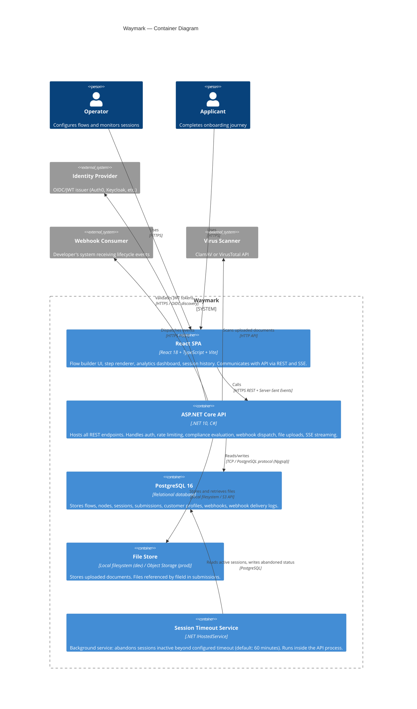

# Container Diagram (C4 Level 2)

This diagram shows the major deployable units within the Waymark system.

## Container Responsibilities

### React SPA (`src/frontend/`)
- Flow builder: drag-and-drop node/connection editor
- Step renderer: schema-driven form engine (renders fields from `jsonContent`)
- Analytics dashboard: flow performance metrics
- Session history: paginated list + detail view
- Webhook delivery inspector: delivery logs + manual retry
- Version history: snapshot diffs + rollback

### ASP.NET Core API (`src/backend/OpenOnboarding.Api/`)
- REST controllers for Flows, Customers, Webhooks, Workflow, Auth, Analytics
- Middleware: CORS, authentication, authorization, rate limiting, correlation ID
- Health probes: `/health/live`, `/health/ready`, `/health`
- Metrics: `/metrics` (Prometheus text format)
- Exception handler: maps domain exceptions to RFC 7807 ProblemDetails

### PostgreSQL Database
- Schema managed via **EF Core migrations** (`OpenOnboarding.Infrastructure/Migrations/`)
- Tables: `Flows`, `Nodes`, `Connections`, `Sessions`, `Submissions`, `CustomerProfiles`, `Webhooks`, `WebhookDeliveries`

### Session Timeout Service
- Polls every minute for sessions where `UpdatedAt < now - SessionTimeoutMinutes`
- Marks timed-out sessions as `Abandoned`
- Configured via `SessionTimeoutMinutes` (default: 60)

## Technology Stack

| Component | Technology |
|-----------|-----------|
| Frontend | React 18, TypeScript, Vite, Vitest, React Testing Library |
| Backend | .NET 10, ASP.NET Core, EF Core 10, FluentValidation |
| Database | PostgreSQL 16, Npgsql |
| Contract testing | PactNet (Rust FFI), Vitest Pact |
| CI/CD | GitHub Actions |
| Container | Docker, Docker Compose |
