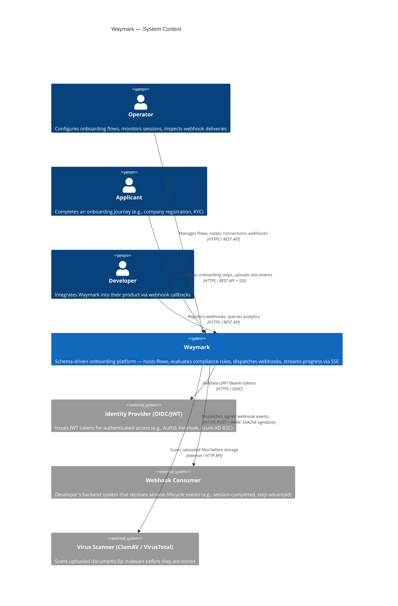

# System Context Diagram (C4 Level 1)

This diagram shows Waymark (open-onboarding) and how it relates to the people and systems around it.

## Key Interactions

| Actor | Interaction | Protocol |
|-------|-------------|----------|
| Operator | Create/edit flows, view analytics, inspect webhook deliveries | REST API (JWT or API Key) |
| Applicant | Start session, submit steps, upload documents, receive live updates | REST API + Server-Sent Events |
| Developer | Register webhooks, receive callbacks, query session history | REST API + HTTPS webhooks |

## Authentication

- **Operators** authenticate via JWT Bearer (from OIDC provider) or X-Api-Key header
- **Applicants** authenticate via JWT Bearer (scoped to Applicant role) or X-Api-Key
- JWT authority is required in non-Development environments (`Authentication:JwtAuthority`)
