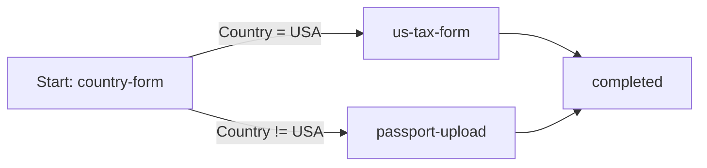

# journey.json reference

This document explains how a `journey.json` (Waymark flow definition) is structured, how to read its notation, how it maps to frontend components, and how to visualize journey paths.

## What `journey.json` represents

`journey.json` is the data model for a Waymark journey. In API terms, it is a **flow definition** with:

- top-level flow metadata
- `nodes` (steps)
- `connections` (directed edges between steps)

Waymark evaluates this graph at runtime to decide the next step for each session.

## Notation and conventions

- IDs are GUID strings (for `flow`, `node`, and connection references).
- `nodes[].jsonContent` is itself JSON, stored as a **string** in the API contract.
- `nodes[].complianceRuleJson` is optional JSON, also stored as a **string**.
- `connections[].priority` is an integer; lower values are evaluated first.
- `condition*` fields can be omitted/null for fallback (unconditional) edges.

### Minimal shape

```json
{
  "name": "Journey name",
  "description": "Optional description",
  "nodes": [],
  "connections": []
}
```

### Example with escaped node schemas

```json
{
  "name": "SMB onboarding",
  "description": "Collect business profile and route by country",
  "nodes": [
    {
      "id": "aaaaaaaa-aaaa-aaaa-aaaa-aaaaaaaaaaaa",
      "key": "country-form",
      "type": "Form",
      "title": "Tell us about your business",
      "jsonContent": "{\"fields\":[{\"name\":\"CompanyName\",\"type\":\"text\",\"required\":true},{\"name\":\"Country\",\"type\":\"select\",\"required\":true,\"options\":[\"USA\",\"GBR\"]}]}",
      "complianceRuleJson": "{\"requiredFields\":[\"CompanyName\",\"Country\"]}",
      "isStartNode": true
    },
    {
      "id": "bbbbbbbb-bbbb-bbbb-bbbb-bbbbbbbbbbbb",
      "key": "passport-upload",
      "type": "DocumentUpload",
      "title": "Upload supporting documents",
      "jsonContent": "{\"acceptedFileTypes\":[\"application/pdf\",\"image/jpeg\"],\"maxFiles\":2}",
      "isStartNode": false
    }
  ],
  "connections": [
    {
      "sourceNodeId": "aaaaaaaa-aaaa-aaaa-aaaa-aaaaaaaaaaaa",
      "targetNodeId": "bbbbbbbb-bbbb-bbbb-bbbb-bbbbbbbbbbbb",
      "conditionField": "Country",
      "conditionOperator": "NotEquals",
      "conditionValue": "USA",
      "priority": 0
    }
  ]
}
```

## Structure reference

### Create/update payload fields (`POST /api/flows`, `PUT /api/flows/{flowId}`)

| Field | Required | Description |
|---|---|---|
| `name` | Yes | Human-readable journey name. |
| `description` | No | Optional journey description. |
| `nodes` | Yes | Array of step definitions. |
| `connections` | Yes | Array of directed edges. |

### Node fields

| Field | Required | Description |
|---|---|---|
| `id` | No | GUID for node identity and edge linkage (defaults to a generated GUID when omitted). |
| `key` | Yes | Stable logical identifier (slug-like). |
| `type` | Yes | `Form`, `DocumentUpload`, `Redirect`, `Information`, or `Logic`. |
| `title` | Yes | Label/instruction rendered in the UI. |
| `jsonContent` | No | Type-specific JSON serialized as a string (defaults to the JSON string `"{}"` when omitted). |
| `complianceRuleJson` | No | Optional validation rules JSON (string). |
| `isStartNode` | Yes | Exactly one node in a journey should be `true`. |

### Connection fields

| Field | Required | Description |
|---|---|---|
| `sourceNodeId` | Yes | Origin node GUID. |
| `targetNodeId` | Yes | Destination node GUID. |
| `conditionField` | No | Payload/profile field to evaluate. |
| `conditionOperator` | No | Comparison operator (`Equals`, `GreaterThan`, etc.). |
| `conditionValue` | No | Value used by the operator. |
| `priority` | Yes | Evaluation order (ascending). |

### Read model fields returned by the API (`GET /api/flows/{flowId}`)

The API response includes additional identity/version fields that are not part of the write payload:

- Top-level flow: `id`, `version`
- Node objects: `id`, `flowId`
- Connection objects: `id`, `flowId`

## Frontend linkage

The journey JSON links directly to frontend behavior:

| Journey JSON field | Frontend component/hook | Effect |
|---|---|---|
| `id` (selected flow) | `App.tsx` + `useOnboarding` | Passed as `StartSessionRequest.flowId` to start a session for the selected journey. |
| `nodes[].type` | `StepRenderer.tsx` | Chooses which UI is rendered for the current step. |
| `nodes[].jsonContent` | `StepRenderer.tsx` | Parsed to build dynamic form fields, upload config, redirect URL, etc. |
| `nodes[].complianceRuleJson` | API + `ComplianceError` handling in `StepRenderer.tsx` | Server validates payload and returns field/global errors. |
| `connections[]` | Runtime engine + `JourneyBuilder.tsx` | Drives routing and shows labeled graph edges. |
| `nodes[]`/`connections[]` | `FlowAuthoringPanel.tsx` + `flowAuthoring.ts` | Edited/validated as JSON in the flow authoring UI. |

## Journey visualization

Waymark provides two complementary visualizations:

1. **Runtime step UI** via `StepRenderer` (current node content).
2. **Graph view** via `JourneyBuilder` (React Flow diagram of nodes and edges).

Conceptually, a journey is a directed graph:



## Authoring tip

For a canonical, end-to-end example already in this repository, use:

- [`flow-definition.example.json`](../src/frontend/src/schemas/flow-definition.example.json)

When posting through the API, ensure each node's `jsonContent` and `complianceRuleJson` are valid JSON strings.
